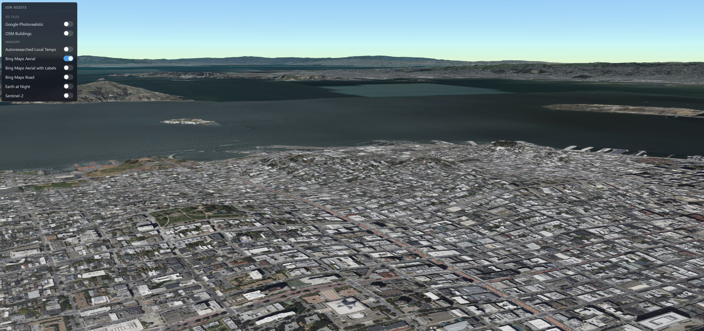
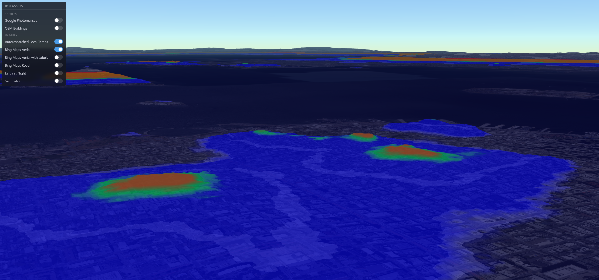

# Geospatial AI Autoresearcher

An autonomous research agent that ingests frontier geospatial and foundation-model signals, structures them into cited evidence, and recommends ranked, demoable 3D experiments — visualized on a CesiumJS workbench.

---

## 1. Motivation

Geospatial AI is moving faster than any single researcher can read. In the last few weeks alone, new foundation models for Earth observation (NASA **TerraMind**, IBM/NASA **Prithvi**), 3D scene understanding (**QueSTMaps**, **Gaussian Grouping**), and world models for remote sensing have shipped — each with its own paper, code, and demo claims. The hard question for practitioners is no longer *"is there a model for this?"* — it's *"given my specific 3D geospatial problem, which model should I try first, and what experiment proves it?"*

Existing literature reviews can't keep up. Generic AI research agents output prose reports, not actionable, scored experiment plans. We wanted a system that:

- **Reads the frontier** (papers, blogs, model launches) on a bounded, fresh source set
- **Structures evidence** with citations — not vibes
- **Recommends concrete, ranked experiments** explicitly grounded in 3D geospatial visualization (CesiumJS terrain, 3D Tiles, overlays, camera paths)
- **Proves it actually did the work** — every run is fully observable

The result is an inspectable, replayable research-to-experiment pipeline that turns the firehose of frontier work into a shortlist of things to actually build.

---

## 2. Results

Across **5 live runs** spanning very different briefs, the pipeline ingested **20–30 real sources per run** (Tavily + arXiv), extracted citation-backed `ResearchRecord`s for every one, and produced a ranked top-3 of CesiumJS-grounded experiments with total scores between **0.80 and 0.90**.

| Time | Brief | Sources | Top Score | Top Experiment |
|---|---|---|---|---|
| 00:27 | **Bay Area microclimate (storyline)** | 20 | **0.89** | High-Resolution Urban Heat Island Visualization |
| 00:21 | NASA TerraMind | 30 | 0.90 | Urban Climate Insights via TerraMind |
| 00:21 | Prithvi IBM/NASA | 30 | 0.90 | Real-Time Climate Downscaling Viz |
| 00:21 | VLM 3D scene understanding | 30 | 0.87 | VLM Scene Understanding for Autonomous Nav |
| 00:21 | NeRF / Gaussian Splatting | 28 | 0.80 | Real-time Urban Scene NeRF + 3DGS |

**Key takeaways:**

- The pipeline **generalizes** — it didn't just work on one tuned brief. Five very different research questions all produced coherent, high-scoring top-3 experiments.
- Every recommendation is **traceable** back to specific retrieved sources (we record `based_on_records[]` per candidate).
- Every run is **observable** end-to-end in Raindrop (see §5).

---

## 3. Demo: Bay Area Microclimate

Storyline example — the agent is asked about **Bay Area urban microclimate**, recommends an **Urban Heat Island visualization** experiment grounded in 3D Tiles, and the result is rendered as a temperature overlay on the CesiumJS workbench.

<table>
<tr>
<td align="center"><b>Before — 3D viewer only</b></td>
<td align="center"><b>After — agent-recommended heat-map overlay</b></td>
</tr>
<tr>
<td></td>
<td></td>
</tr>
<tr>
<td><i>Raw RGB + geometry. No semantic signal.</i></td>
<td><i>Temperature heat-map overlay generated from the agent's top-ranked experiment, fused with 3D Tiles in CesiumJS.</i></td>
</tr>
</table>

---

## 4. Pipeline

**Approach:** an auto-research agent reads frontier work → structures it into machine-readable knowledge → recommends concrete experiment designs for a specific user problem.

**Demo flow:** given a brief about *Bay Area temperature microclimate*, the agent retrieved 20 real sources (Tavily blogs + arXiv papers covering Urban Heat Islands, LBL microclimate studies, Bay Area satellite climate work, multimodal urban prediction…), recommended an experiment grounded in **NASA TerraMind / urban climate modeling**, and the result is visualized as a temperature overlay on the CesiumJS 3D platform.


The four data contracts (`SourceCandidate`, `ResearchRecord`, `ExperimentCandidate`, `ExperimentScore`) are defined in [`json-structure.md`](json-structure.md). The orchestrator follows an Anthropic **workflow** pattern (not autonomous agent) — a deterministic prompt-chain `retrieve → extract* → plan`, where `*` is parallelization across sources. Deployed on **Modal** with HTTP endpoints; structured outputs enforced via OpenAI's Pydantic-native `responses.parse`.

---

## 5. Observability with Raindrop

### The problem with "agent demos"

Most agent demos at hackathons are unverifiable. You see a polished output, but you can't tell whether an agent actually ran, what it retrieved, what it considered, or whether the answer was hard-coded. **We wanted to prove ours was real.**

### What we built with Raindrop

We integrated **Raindrop** as the observability layer for our autoresearch pipeline. Every time a user submits a research brief, the entire workflow is captured as a structured trace:

```
autoresearch_run             (interaction — one per pipeline call)
├─ retrieve_sources          (task span)
│   ├─ tavily_search         (tool span — query, results, count)
│   └─ arxiv_search          (tool span — query, results, count)
├─ extract_record × N        (task spans — parallel LLM calls per source)
└─ plan_experiments          (task span — generates and ranks top-3)
```

Each span records its **inputs, outputs, latency, model, and custom properties** — geospatial relevance scores, source titles, top-experiment titles, total scores. Even the underlying OpenAI calls are auto-instrumented through Raindrop's OpenTelemetry integration, so we get model name, token usage, and latency for free.

### What this buys us

1. **Verifiable autonomy.** Open the Raindrop trace tree and you can see the agent retrieved 30 real sources from Tavily and arXiv, ran 30 parallel extractions, and produced a ranked top-3. No fake data.
2. **Cross-run comparison.** We ran five different briefs end-to-end — Bay Area microclimate, NASA TerraMind, Prithvi, VLM scene understanding, NeRF/Gaussian Splatting — and the planner produced top scores between 0.80 and 0.90 on every one. The pipeline generalizes.
3. **Debugging the agent itself.** When retrieval silently failed in an early version, the Raindrop trace showed it instantly: `retrieve_sources.output.count = 0`, but the planner still produced experiments. That's the exact failure mode you'd never catch without observability.
4. **Pitch evidence, not just claims.** We can hand a judge the dashboard URL, and they verify the agent loop themselves.

> **Raindrop turned our autoresearch pipeline from a black-box demo into an inspectable, replayable, comparable agentic system — and that's the difference between a hackathon trick and a real product.**

---

## Repo Layout

```
src/agents/
├── schemas.py     # Pydantic contracts (json-structure.md)
├── retrieve.py    # Step 1 — Tavily + arXiv (Raindrop tool_spans)
├── extract.py     # Step 2 — per-source LLM extraction (parallel)
├── plan.py        # Step 3 — generate + score top-3 in one call
└── pipeline.py    # Orchestrator + Raindrop interaction wrapper
modal_app.py       # Modal deployment + HTTP endpoints
app/               # CesiumJS frontend (see below)
assets/            # Demo screenshots and pipeline diagram
```

## Running the backend

```bash
# Local
export OPENAI_API_KEY=...
export TAVILY_API_KEY=...
export RAINDROP_WRITE_KEY=...
pip install -r requirements.txt
python -m src.agents.pipeline "frontier 3D geospatial / world models"

# Deployed (Modal)
curl "https://wanning-he-gr--geospatial-ai-autoresearcher-research.modal.run?brief=...&n_tavily=20&n_arxiv=10"
curl "https://wanning-he-gr--geospatial-ai-autoresearcher-latest.modal.run"
```

## Running the CesiumJS App

The frontend lives in the [`app/`](app/) directory. It's a Vite + React + TypeScript app powered by CesiumJS.

### Prerequisites

- [Node.js](https://nodejs.org/) (v18+)
- A free [Cesium ion](https://ion.cesium.com/) account and access token

### Setup

1. **Get a Cesium ion token.** Sign in at [ion.cesium.com](https://ion.cesium.com/), go to **Access Tokens**, and copy your default token (or create a new one).

2. **Create your local env file**

   ```sh
   cd app
   cp .env.example .env.local
   ```

   Open `app/.env.local` and replace `PASTE_YOUR_TOKEN_HERE` with your token:

   ```env
   VITE_CESIUM_ION_ACCESS_TOKEN=eyJhbGci...your-token-here
   ```

3. **Install dependencies**

   ```sh
   cd app
   npm install
   ```

4. **Start the dev server**

   ```sh
   npm run dev
   ```

   Open [http://localhost:5173](http://localhost:5173) in your browser. You should see a 3D globe flying to San Francisco with OSM buildings loaded.

### Other commands

| Command | Description |
| --- | --- |
| `npm run dev` | Start dev server with hot reload |
| `npm run build` | Production build (output in `app/dist/`) |
| `npm run preview` | Preview the production build locally |
| `npm run lint` | Run ESLint |
